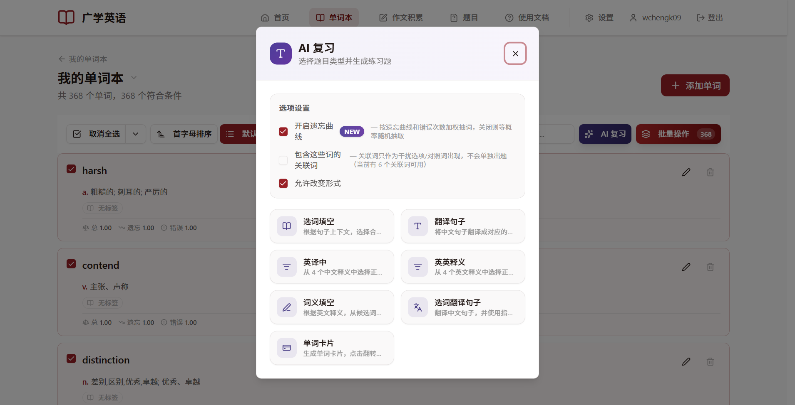
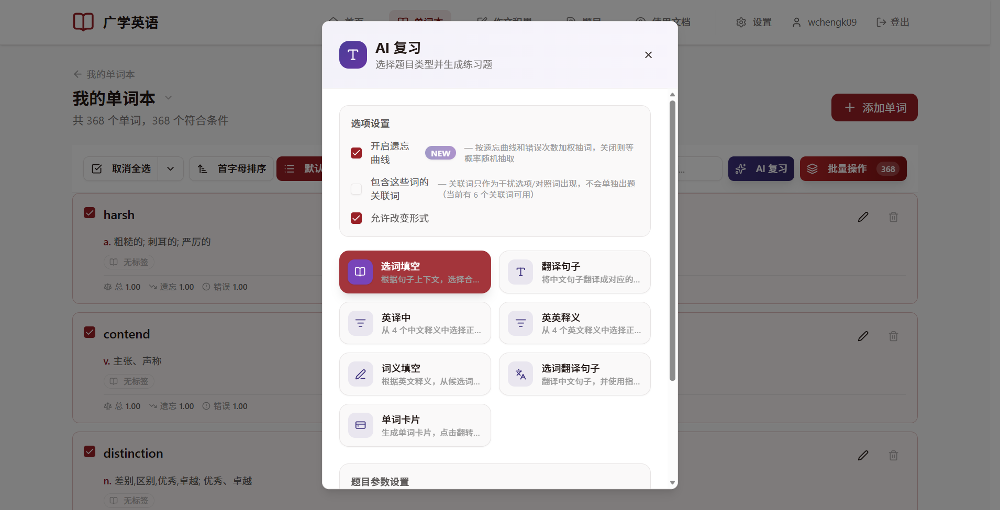

# AI 复习与题型

**AI 复习是广学英语的核心功能**。它会用 AI 把你选中的单词出成各种练习题，而不是简单地让你看释义。

## 从哪里进入 AI 复习

有三个入口，打开的都是同一个「**AI 复习**」窗口：

1. **首页**：点「一键复习」，自动从全部（或指定范围的）单词里按遗忘曲线挑词。
2. **单词本**：选中若干单词后，点工具栏的「**AI 复习**」。
3. **答题页**：做完一题后点「**巩固练习**」，用刚才的词换个题型再练。

## AI 复习窗口

窗口分两部分：上面是「**选项设置**」，下面是「**题目类型**」。

### 选项设置

有三个开关，它们会被浏览器记住，下次打开还保持上次的选择：

| 开关 | 默认 | 作用 |
| --- | --- | --- |
| **开启遗忘曲线** | 开 | 按「快忘了 + 老出错」优先抽词；关掉就是完全随机抽词 |
| **包含这些词的关联词** | 关 | 把选中单词的关联词也加入题池，作为干扰项或对照词出现，不会单独出题 |
| **允许改变形式** | 开 | 仅对「选词填空」有效：答案允许使用单词的变形（如时态、单复数） |

> 关于「遗忘曲线」到底怎么挑词，见本文末尾的[《遗忘曲线是怎么回事》](#遗忘曲线是怎么回事)。

### 七种题型

| 题型 | 说明 | 适合 |
| --- | --- | --- |
| **选词填空** | 给一个句子，从候选词里选词填进空格 | 练语境和搭配 |
| **翻译句子** | 把中文句子翻译成英文，每题必用一个指定词 | 练主动输出 |
| **英译中** | 从 4 个中文释义里选正确的 | 快速过词义 |
| **英英释义** | 从 4 个**英文**释义里选正确的 | 用英语理解英语 |
| **词义填空** | 给英文释义，从候选词里选出正确的单词 | 反向回忆拼写 |
| **选词翻译句子** | 翻译中文句子，并使用指定的候选单词 | 综合输出 |
| **单词卡片** | 生成可翻面的卡片，正面单词、背面释义 | 轻松浏览、自测 |

### 题目参数

不同题型能调的参数不一样，选中题型后会在下方出现「**题目参数设置**」。常见参数有：

- **题目数量 n**：想出几道小题。
- **干扰词数量 m**（多余单词数）：额外加多少「不是答案、只用来混淆」的词（部分题型支持）。

系统会自动检查参数是否合法：

- 题目数量不能超过你选中的单词数；
- 选词填空、词义填空等题型，`n + m` 不能超过可用单词数，且总数不超过 11；
- 若参数不合法，生成按钮会被禁用，并提示原因。

改词量或切换选项时，参数会自动调整到合法范围，不用手动改。

## 生成与作答

1. 选好题型和参数，点底部的「**生成…**」按钮。
2. 题目会先以「**生成中**」状态出现在「题目」页面，稍等片刻会变成「**生成完毕**」。
3. 点「开始作答」进入答题页作答，提交后由 AI 或系统自动批改（详见[《题目与作答》](/english/guide/practice.md)）。

> AI 生成需要一些时间（通常十几秒到一分钟），期间你可以离开去干别的，回来题目就出好了。

## 遗忘曲线是怎么回事

你不需要懂算法，只需要知道它做到了两件事：

1. **快忘了的词优先出现**：刚复习完的词短期内不会再出；隔得越久、越接近遗忘，越会被优先抽到。
2. **老出错的词优先出现**：错得越多，权重越高，越容易被抽中。答对几次后，错误权重会快速下降，不再霸占复习队列。

所以你只要**经常打开、随手点一键复习**，系统就会自动帮你把该复习的词安排上，不用自己算「几天后该复习」。

单词卡片底部和首页统计里的「待复习 / 新词」等数字，都是根据这套规则实时算出来的。

## 单词卡片怎么用

「单词卡片」不经过 AI，直接生成，最省时间。打开后：

- 点击卡片可**翻转**查看释义；
- 看完后点「**会**」或「**不会**」，系统会据此更新这个词的复习状态，并自动翻到下一张；
- 全部标记完会显示总结（会几个、不会几个）。

## 常见问题

**Q：生成失败怎么办？**
A：在「题目」页面找到状态为「生成失败」的记录，点「重试」即可。

**Q：为什么只出了我选的一部分词？**
A：题量由你设置的「题目数量 n」决定，AI 会从词池里挑一部分出来。想覆盖更多词，把 n 调大即可。

**Q：关联词会单独出题吗？**
A：不会。关联词只作为干扰选项或对照词出现。
