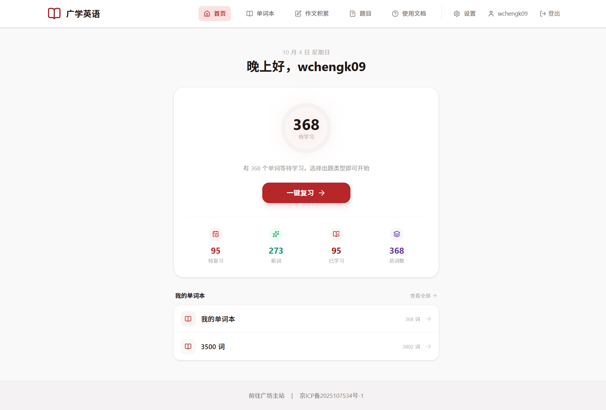

# 首页与一键复习

登录后，你会来到广学英语的**首页**。首页是你每天打开网站后「看一眼就知道今天该背什么」的地方。

## 顶部导航栏

页面最上方一排是全局导航，登录后一直可见：

- **首页**：回到当前页。
- **单词本**：管理你的所有单词本。
- **作文积累**：收集好词好句（该功能计划从当前项目分离，暂无详细文档）。
- **题目**：查看已生成的练习题并作答（见[《题目与作答》](/english/guide/practice.md)）。
- **使用文档**：打开这份教程。
- **设置**：AI 模型、复习范围、标签管理等（见[《设置与标签》](/english/guide/settings.md)）。
- 最右侧显示你的用户名和「**登出**」按钮。

> 手机上导航文字会缩成图标，功能完全一样。

## 首页在告诉你什么

首页中间的大卡片是你的「今日复习台」。

### 中间的大数字：待学习

大圆圈里的数字表示**目前等待学习的单词数量**，它等于「**待复习** + **新词**」。也就是说，这个数字代表「现在动手复习，能覆盖多少词」。

如果这个数字是 0，说明暂时没有需要复习的内容，可以先去添加新单词。

### 下方四个小数字

大数字下方有四格统计，从左到右分别是：

| 名称 | 含义 |
| --- | --- |
| **待复习** | 以前学过、按遗忘曲线已经「到点该复习」的单词数 |
| **新词** | 还从未复习过的单词数 |
| **已学习** | 已经复习过的单词数 |
| **总词数** | 你所有单词本里的单词总数 |

> 这些数字的统计范围可以在「设置 → 一键复习范围设置」里调整，默认统计全部单词本。

## 一键复习

想立刻开始练习时，点击大卡片上的「**一键复习**」按钮：

1. 网站会按[遗忘曲线](/english/guide/ai-review.md)从你的单词里挑选一组最该复习的词；
2. 弹出「AI 复习」窗口，让你选择题目类型（比如选词填空、翻译句子）；
3. 选好后点生成，AI 就会开始为你出题，随后跳转到答题页面。

关于题型和设置的细节，请看[《AI 复习与题型》](/english/guide/ai-review.md)。

> **小技巧**：如果你是第一次使用、还没有任何单词，首页会显示「还没有添加任何单词」，点击「去添加单词」即可跳到单词本页面。

## 我的单词本

首页底部会列出你最近更新的单词本，右侧的「**查看全部**」可以进入完整的单词本列表。点击任意一个单词本即可进入。

单词本的具体用法见[《单词本》](/english/guide/wordbook.md)。

## 常见问题

**Q：为什么「待复习」是 0，但「待学习」很大？**
A：说明你的词大多是**新词**（还没复习过），它们在「新词」里。点「一键复习」同样会抽到它们。

**Q：数字会自己变吗？**
A：会。每次做完题、复习状态更新后，数字会重新计算。页面刷新即可看到最新结果。
