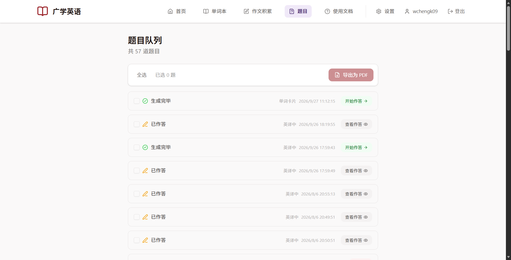
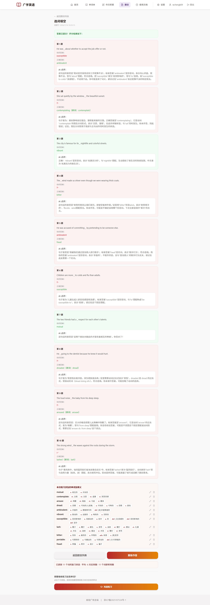
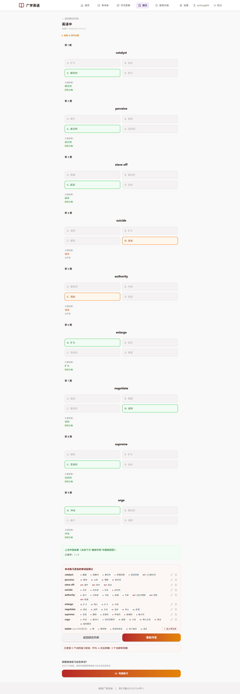
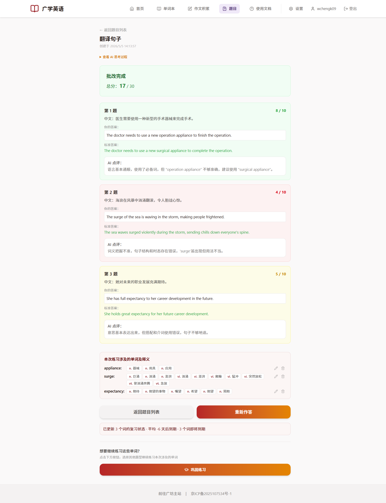
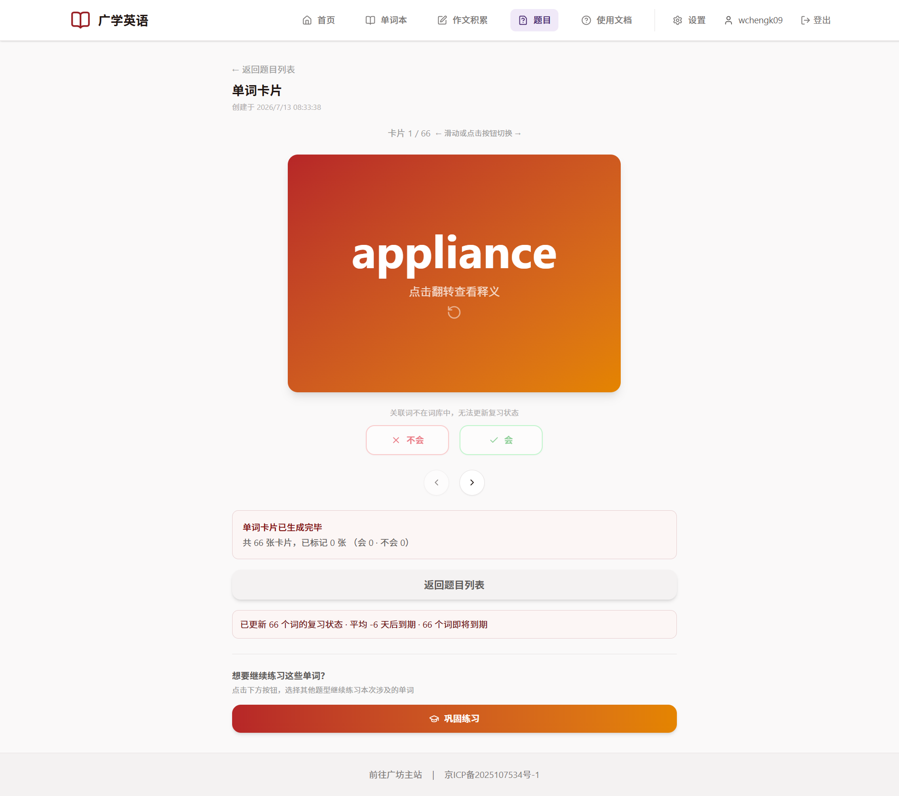

# 题目与作答

AI 生成的练习题都会集中在「**题目**」页面。这里可以查看题目状态、进入作答、重试失败的题目，也可以把题目导出成 PDF。

## 题目队列

点击顶部导航的「**题目**」：

顶部显示「共 X 道题目」，下面是题目列表。每一条记录包含：

- 一个复选框（用于批量导出）；
- **状态**：生成中 / 生成完毕 / 批改中 / 已作答 / 生成失败 / 批改失败；
- **题型**：这道题是什么类型；
- **创建时间**；
- 右侧的操作按钮。

### 不同状态能做什么

| 状态 | 含义 | 可以做的操作 |
| --- | --- | --- |
| **生成中** | AI 正在出题 | 打开后显示实时进度条，等待即可 |
| **生成完毕** | 题目已就绪 | **开始作答** |
| **批改中** | 提交后正在批改 | **查看进度** |
| **已作答** | 已完成并批改 | **查看作答** |
| **生成失败** | 出题时出错 | **重试**（重新生成题面） |
| **批改失败** | 批改时出错 | **重新批改** |

### 导出为 PDF

勾选若干题目后，点「**导出为 PDF**」即可保存题目和参考答案，方便打印成纸质练习。

> 只有「生成完毕 / 已作答 / 批改中」的题目能被勾选导出。

## 作答页面

点击「开始作答」（或「查看作答」）进入答题页。页面顶部有「← 返回题目列表」，标题是题型名称。

不同题型作答方式略有不同，下面分别说明。

### 选词填空

上方列出所有**可选单词**，点击某个单词可以把它标记为「已用」（划掉并移到末尾），方便排除。

- 每题一个空格，在输入框里填入单词。
- 如果题目允许改变形式，你填的词可以是原词的变形。
- 全部填完后点「提交答案」，如果有题没答会再确认一次。
- 提交后显示对错、正确答案（若改变了形式还会标注「原词」）以及 **AI 点评**。

### 词义填空

给出一句英文释义，从候选词里选出正确的单词填入。作答和批改方式与选词填空类似。

### 英译中 / 英英释义

每题给出一个单词，下面有 A / B / C / D 四个选项，点选你认为正确的那个。

提交后显示正确率和逐题结果：答对会标绿，答错标红，未作答的选项会标成橙色。

### 翻译句子

每题给出一个中文句子和一个「必用单词」。

- 在文本框里输入你的英文翻译，可用「**清空重写**」重来。
- 点「提交全部」后由 AI 批改，给出**分数、标准答案和 AI 点评**，按得分高低显示不同颜色。

### 选词翻译句子

和「翻译句子」类似，但会给你一组**候选单词**，要求翻译时用上它们。

### 单词卡片

不批改，供你浏览和自测。

- 卡片正面是单词，点击**翻转**看释义。
- 若出题时开启了「AI 生成例句」，释义下方会显示例句：生成期间先显示「例句生成中…」，补齐后自动出现（详见[《AI 复习与题型》](/english/guide/ai-review.md)）。
- 点「**会**」或「**不会**」标记，系统据此更新复习状态并自动翻到下一张。
- 觉得太简单可以点「**太简单了，从单词本删去**」把词移出单词本；删错了点「**已删除，点击撤回**」即可还原。
- 底部显示总卡片数和已标记数量。

## 查看批改结果

已作答的题目可以随时点「查看作答」回看，无需重新批改。批改结果包括：

- **分数或正误**；
- **标准答案**；
- **AI 点评**：指出你错在哪、该怎么改。

很多题面还带一个「**查看 AI 思考过程**」的折叠项，好奇的话可以展开看看 AI 是怎么想的。

## 本次练习涉及的单词

答题页底部有一块「**本次练习涉及的单词及释义**」：

- 列出这道题涉及的所有单词和释义；
- 如果某个单词是别人单词本里的**关联词**、你还没有，可以点「**加入单词本**」把它收进来；
- 也可以在这里直接**编辑释义**或**删除单词**。

## 重新作答与巩固练习

- **重新作答**：点击后会清空这次作答，可以重做一遍（重做会算作一次新的复习）。
- **巩固练习**：做完一题后，页面底部会出现「想要继续练习这些单词？」，点「巩固练习」可以用刚才这些词换个题型再出一组题。

作答完成后，页面还会提示这次复习对单词状态的更新，例如「已更新 N 个词的复习状态 · 平均 X 天后到期」，帮助你了解[遗忘曲线](/english/guide/ai-review.md)的效果。

## 常见问题

**Q：题目一直停在「生成中」？**
A：答完题跳转后即可看到实时进度条（含当前阶段和已等待时间）。AI 出题通常需要几十秒到几分钟，请耐心等待，进度完成后会自动显示题面，无需刷新。若进度长时间不动，可在列表页重试。

**Q：为什么以前出题时页面一直转圈、要刷新才能看到进度？**
A：这是历史问题，现已修复：出题改为后台任务触发，等待期间不再阻塞页面读取题目状态，因此进度条会实时显示。

**Q：批改失败了怎么办？**
A：在列表页找到「批改失败」的题目，点「重新批改」。

**Q：显示的「X 天后到期」是什么意思？**
A：这是遗忘曲线根据你这次的表现，算出这个词下次大概什么时候该复习。
