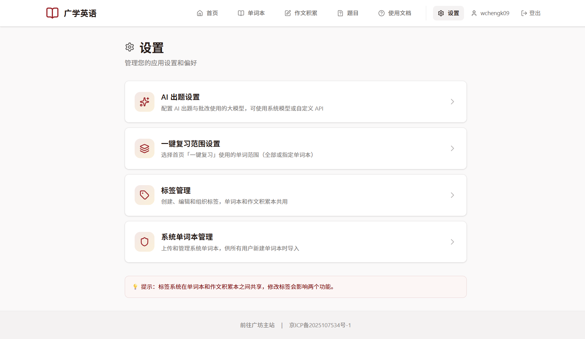
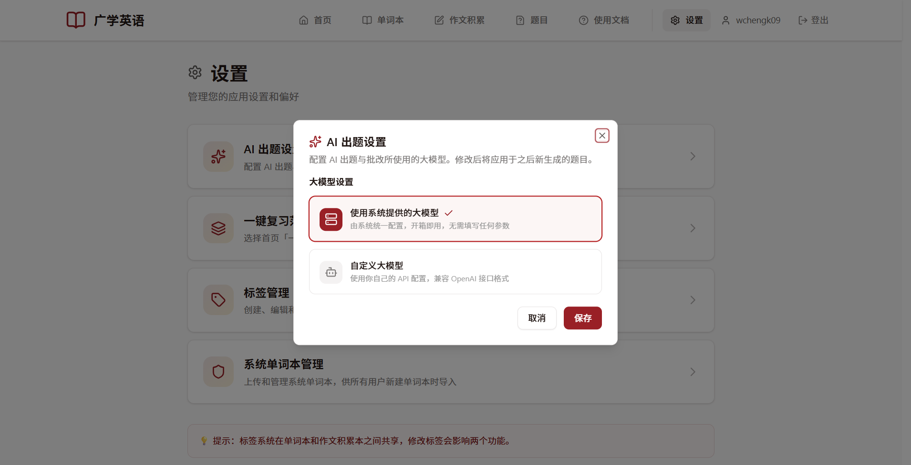
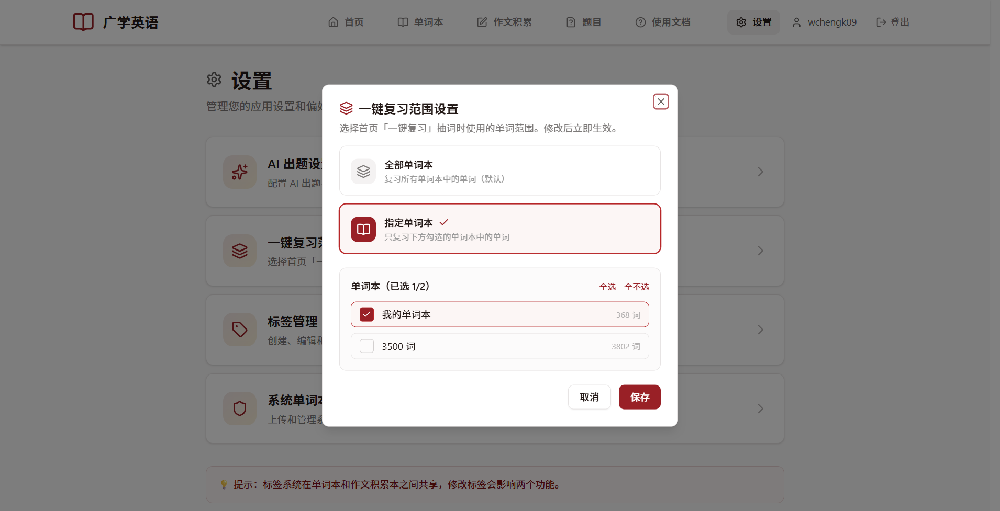
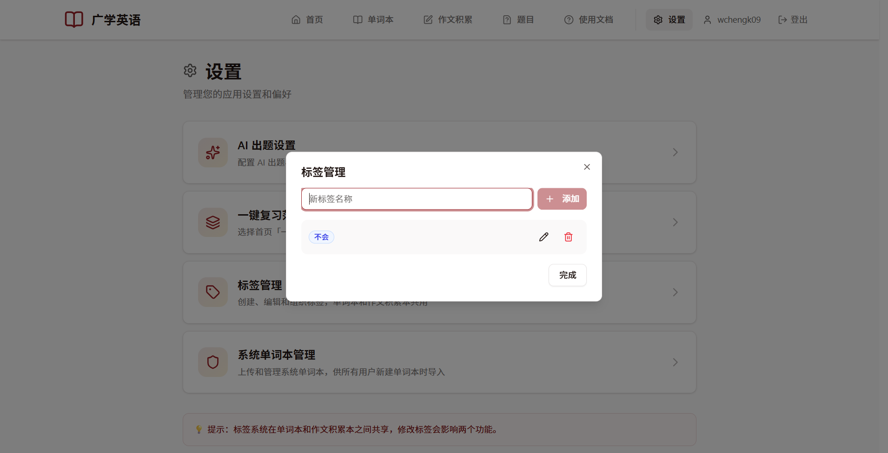

# 设置与标签

点击顶部导航的「**设置**」，进入设置页面：

设置页面里有几个入口，点进去都是弹窗，改完保存即可。

## AI 出题设置

设定 AI 出题和批改时使用哪个大模型：

- **使用系统提供的大模型**（默认）：由网站统一配置，**开箱即用，什么都不用填**。
- **自定义大模型**：如果你有自己的 API，可以填 API Key、API Base、模型名称，使用自己的模型。

> 普通用户保持默认即可。自定义模型需要兼容 OpenAI 接口格式。

## 一键复习范围设置

决定首页「一键复习」从哪些单词里抽词：

- **全部单词本**（默认）：复习所有单词本里的词。
- **指定单词本**：只复习你勾选的那几个单词本里的词。

改动后立即生效。

## 标签管理

创建、编辑、删除标签。标签在**单词本**和**作文积累**之间共享：

- 在输入框输入名称，点「**添加**」即可新建标签。
- 每个标签右侧的铅笔可改名、换颜色，垃圾桶可删除。
- 有 13 种预设颜色可选。

> 删除正在被使用的标签时，会提示它被多少单词、多少作文积累使用，删除后会自动从这些内容中移除该标签。

## 系统单词本管理（仅管理员）

如果你是管理员，设置里还会多出「**系统单词本管理**」：

- 上传 / 粘贴一份单词表，创建供所有用户导入的系统单词本；
- 支持 JSON / TXT / CSV/TSV 等格式；
- 可以编辑或删除已有系统单词本。

> 普通用户看不到这一项。系统单词本的具体导入方式见[《单词本》](/english/guide/wordbook.md)。

## 关于标签的小知识

标签是你自己的一套分类方式，常见的用法有：

- 按来源分：课本词汇、试卷生词、阅读积累；
- 按掌握程度分：不熟、易错、已掌握；
- 按知识点分：熟词生义、固定搭配、形近词。

打好标签后，就能在单词本里用「筛选」快速挑出一类词来集中复习。
