# 单词本

**单词本是广学英语的地基**：你所有的生词都存放在单词本里，AI 出题、复习都从这里取词。

一个账号可以有多个单词本，比如「课本词汇」「试卷生词」「阅读积累」。同一个单词也可以同时属于多个单词本，不会重复存储。

## 单词本列表

进入顶部导航的「**单词本**」，你会看到所有单词本：

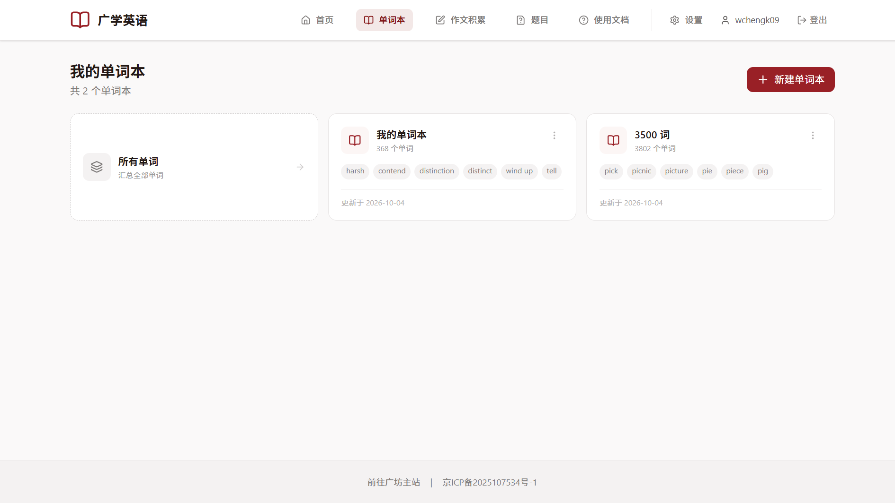

- 左上角的「**所有单词**」卡片：汇总你所有单词本里的全部单词（相当于「全部」视图）。
- 每个卡片显示单词本名称、单词数量、更新时间，以及几个单词预览。
- 每个卡片右上角的「⋯」是「**更多操作**」，可以**重命名**或**删除**单词本。

点击「所有单词」会进入一个汇总视图，里面是你所有单词本里单词的并集：

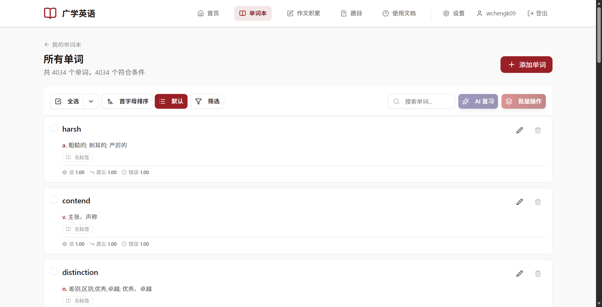

### 新建单词本

点击右上角的「**新建单词本**」：

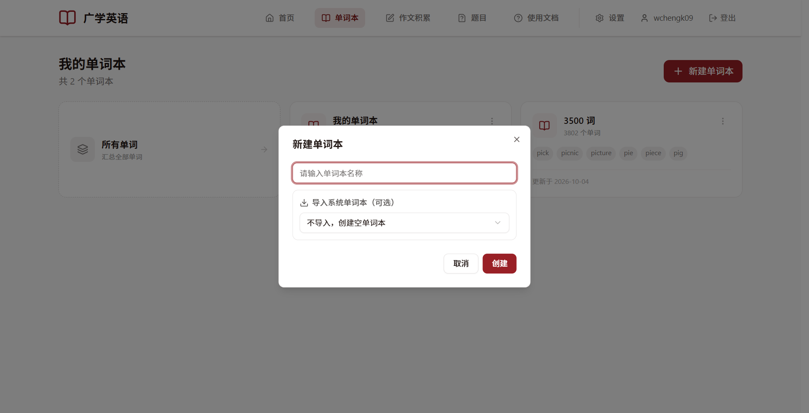

1. 输入单词本名称（最多 50 个字）。
2. （可选）选择「**导入系统单词本**」，可以一次性复制一整个现成的词库。

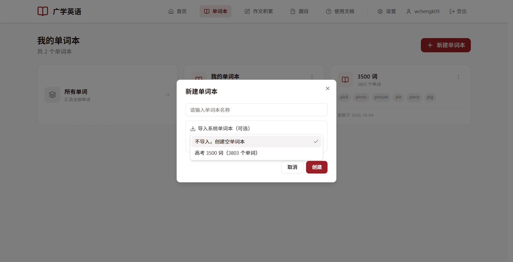

系统单词本是管理员维护的公共词库，例如「高考 3500 词」。导入后会把它里面的所有单词复制到你的新单词本，**复制出来的词你可以随意修改，不会影响系统词库**。

> 如果暂时不需要，保持默认的「不导入，创建空单词本」即可。

### 删除单词本

在卡片「⋯」菜单里选「删除」后会弹出确认框。请注意：

> 仅属于该单词本的单词会被**一并删除且不可恢复**；如果某个单词同时也在别的单词本里，则只解除在这个单词本里的关联，单词本身保留。

## 进入单词本

点击任意单词本即可进入。也可以用标题旁的「**切换单词本**」下拉框快速跳到别的单词本。

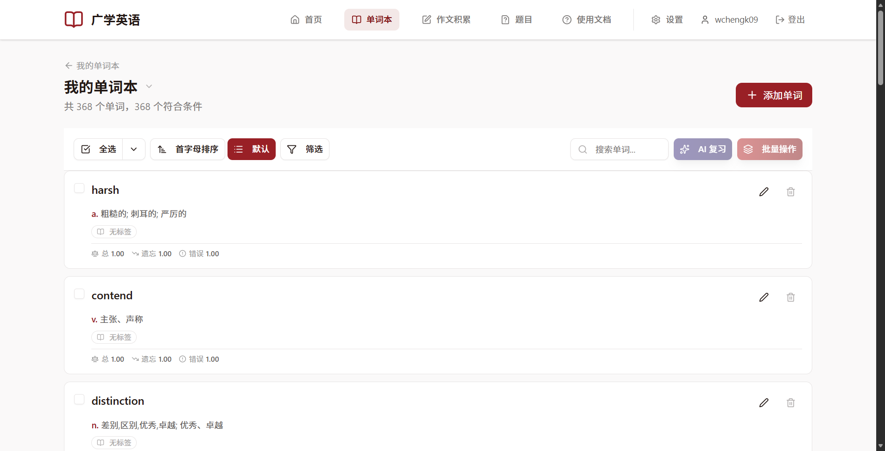

- 标题下方显示「共 X 个单词，Y 个符合条件」。
- 右上角「**添加单词**」用于新增生词。

## 添加单词

点击「**添加单词**」，会弹出窗口：

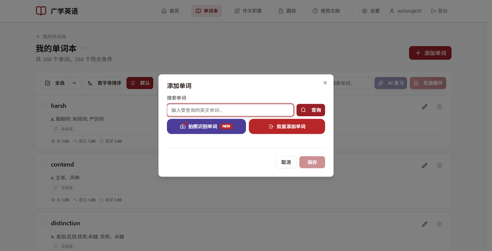

有三种添加方式：

### 方式一：添加单个单词

在搜索框输入单词，点「查询」或按回车：

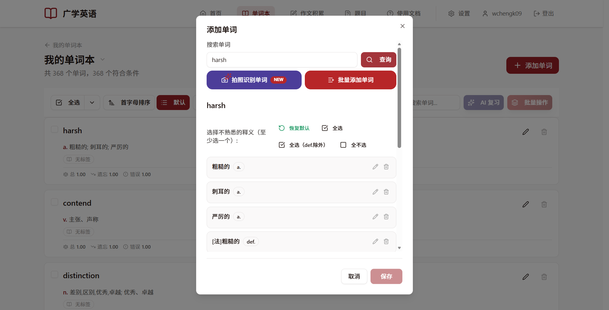

系统会从内置词典里查出这个词的所有释义。**勾选你不熟悉的那几个释义**即可：

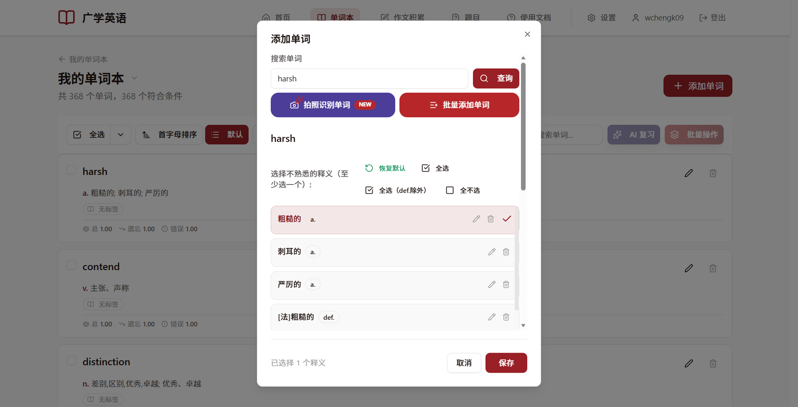

> **一词多义**：不必把所有释义都选上，只选你**不会**的即可。AI 复习时只会针对你勾选的释义出题。

如果某个释义词典里没有，可以自己补充：在「**添加释义**」里输入内容、选择词性（不选就默认「自定义」），点「添加」：

#### 给它打标签

你可以给单词贴上标签（如「熟词生义」「模考高频」），方便日后筛选复习：

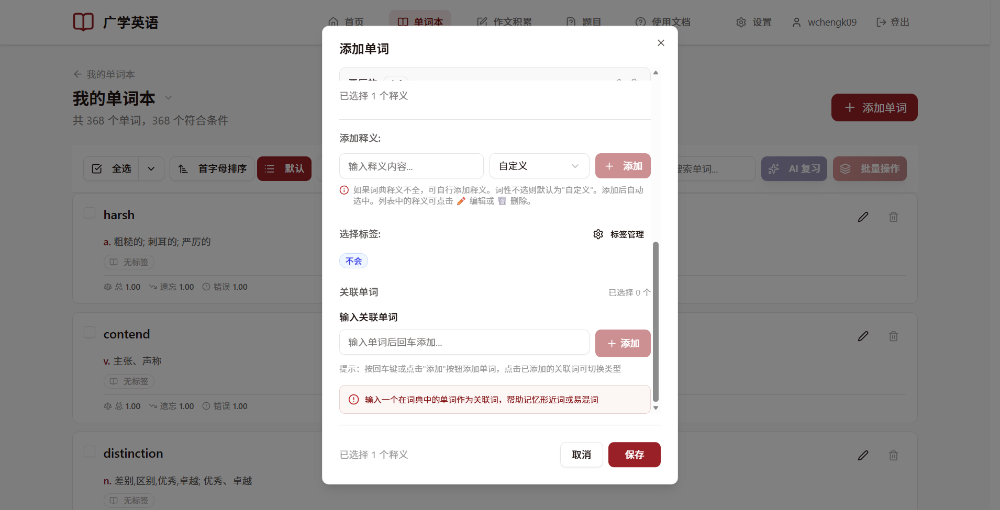

> 标签的管理（增删改、换颜色）在「设置 → 标签管理」里，也可以点这里的「标签管理」按钮进入。

#### 关联词

「关联词」是帮助记忆的辅助词，可以填**不同形式**（如 harsh → hardship）或**容易混淆**（如 effect / affect）的单词。点击已添加的关联词上的类型按钮即可在两种类型间切换：

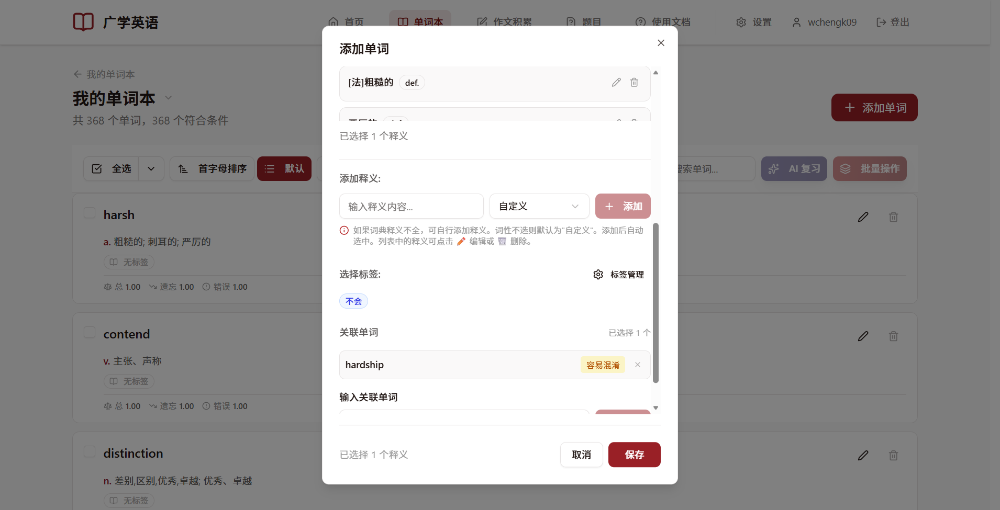

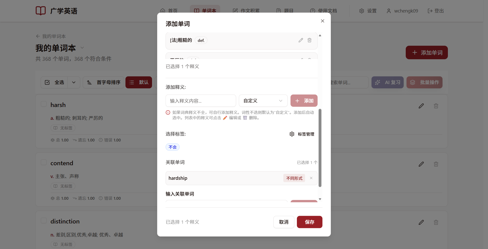

> 关联词不必在单词本里，但必须是词典中存在的单词，否则会提示「该单词不在词典中，请检查拼写」。

### 方式二：批量添加单词（推荐）

适合一次性录入大量生词。在添加窗口点击「**批量添加单词**」：

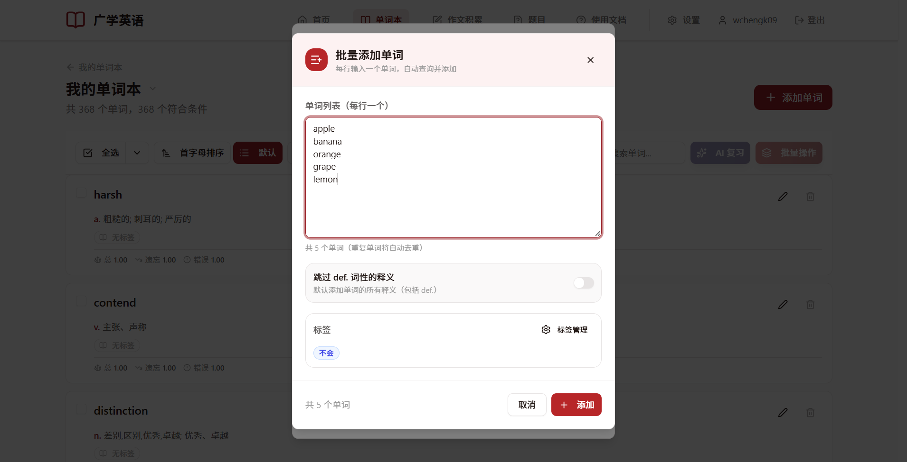

- 在文本框里**一行一个**输入单词，重复的会自动去重。
- 可勾选「**跳过 def. 词性的释义**」（`def.` 通常是一些专业领域的冷门释义）。
- 可以给这批单词统一设置标签。
- 点「添加」后会逐个查询并入库，完成后有成功 / 失败 / 跳过清单：

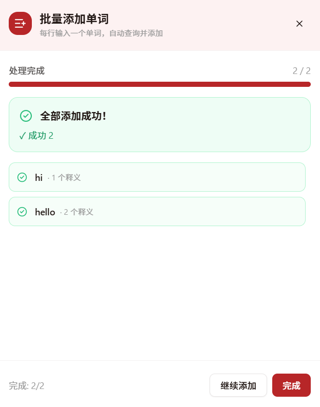

> 如果有个别单词失败了，可以点「编辑」单独补录，或点「重试失败项」。

### 方式三：拍照识别单词（不推荐）

点击「**拍照识别单词**」，上传用荧光笔高亮的纸质资料照片：

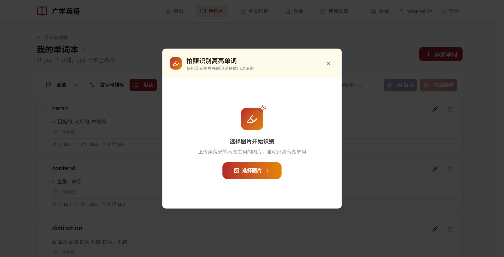

> **注意**：目前该功能**识别准确率很低**，仅在图片清晰、高亮规范时效果较好。**不推荐日常使用**；需要快速录入大量单词时请优先用「批量添加单词」。
>
> 识别服务为按需启动，**首次识别需要等待约 10 秒**加载模型，之后会明显加快。

## 管理单词列表

进入单词本后，列表上方的工具栏可以帮你快速找到和操作单词：

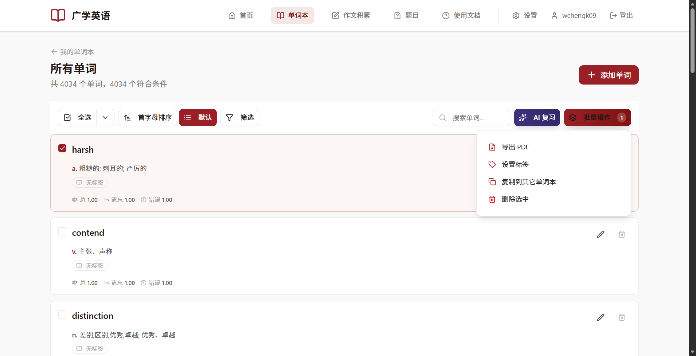

从左到右依次是：

- **全选 / 取消全选**：勾选当前页所有单词。右侧小箭头里还有「**区间选择**」，可以点两个端点选中一整段。
- **首字母排序 / 默认**：切换排序方式。
- **筛选**：按标签筛选。可以选「全部满足」或「任一满足」：

  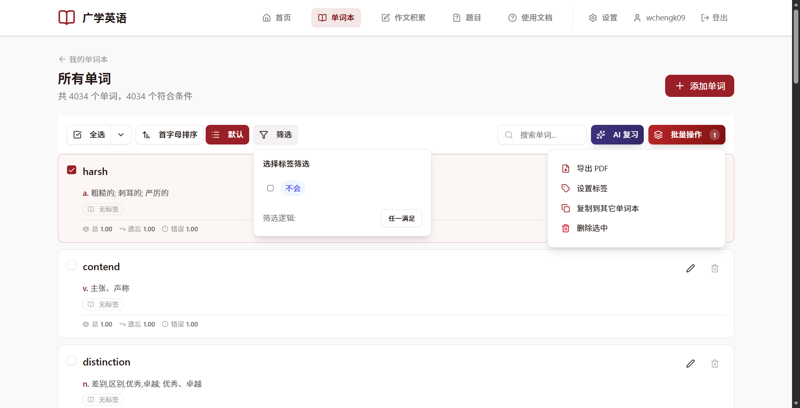

- **搜索单词**：在搜索框里输入关键词，单词、释义、标签都能模糊匹配到。
- **AI 复习**：把选中的单词交给 AI 出题（见[《AI 复习与题型》](/english/guide/ai-review.md)）。
- **批量操作**：对选中的单词做批量处理。

### 批量操作

选中若干单词后点「**批量操作**」，菜单里有：

| 操作 | 说明 |
| --- | --- |
| **导出 PDF** | 把选中的单词导出成 PDF，方便打印 |
| **设置标签** | 批量给选中的单词设置标签（可「全选」或「清空」） |
| **复制到其它单词本** | 把单词复制到别的单词本（原处保留） |
| **移动到其它单词本** | 把单词移到别的单词本（原处移除） |
| **删除选中** | 删除选中的单词（会从**所有**单词本中一并删除，不可恢复） |

> 在「所有单词」视图里没有「移动到其它单词本」，因为无法确定要从哪个单词本移出。

复制 / 移动时会让你勾选目标单词本，已经存在的单词会自动去重，不会重复添加。

### 编辑或删除单个单词

每张单词卡片右侧有铅笔和垃圾桶图标，分别是**编辑**和**删除**。

- 编辑可以修改释义、标签、关联词。
- 删除会把它从所有单词本中移除，请谨慎操作。

## 分页与显示条数

列表底部可以选择**每页显示 10 / 20 / 50 / 100 条**，并用页码翻页。

## 单词卡片上的「总 / 遗忘 / 错误」

每张单词卡片底部有三个数字：

- **总**：这个词当前的综合复习权重。
- **遗忘**：离「快忘了」有多近。
- **错误**：你答错它的次数。

鼠标悬浮在数字上会看到解释。这三个数字由[遗忘曲线](/english/guide/ai-review.md)自动计算，你不需要手动修改；数字越大，越会优先被抽到复习。
